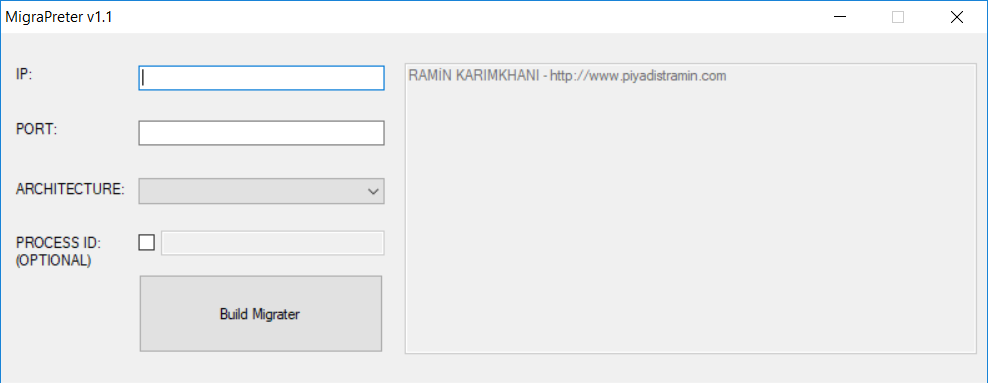
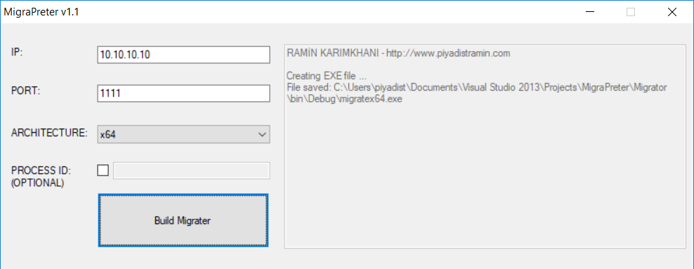
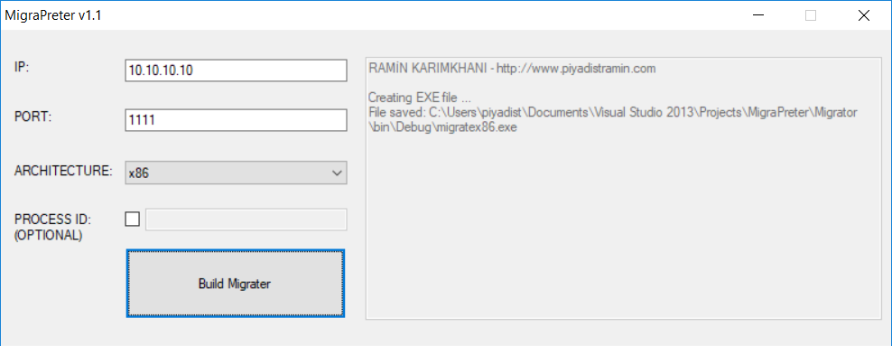
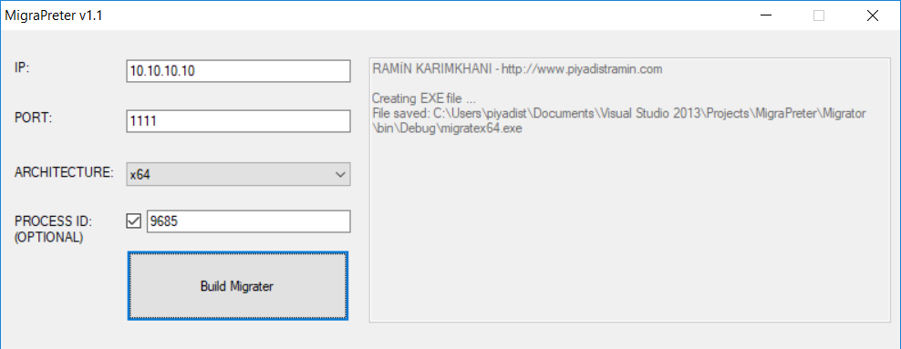

# MigraPreterv1.1
I developed the MigraPreter tool to migrate to a process running on a Windows machine. This tool uses meterpreter / reverse_tcp payload to create an EXE file according to the selected architecture by entering the IP address and port number of the machine that started the listening mode with the metasploit tool. When this file is run, the meterpreter session will be obtained through any process running on the Windows machine.  

Project Blog http://piyadistramin.com/tr/blog

I made updates on the MigraPreter tool and published it as "version 1.1". With MigraPreter, you can create an EXE file to migrate the process by entering the ID value of a desired process. Migration to an arbitrary process could prevent dangerous migration of LSASS.EXE, CSRSS.EXE, and WINLOGON.EXE.

MigraPreter v1.1

